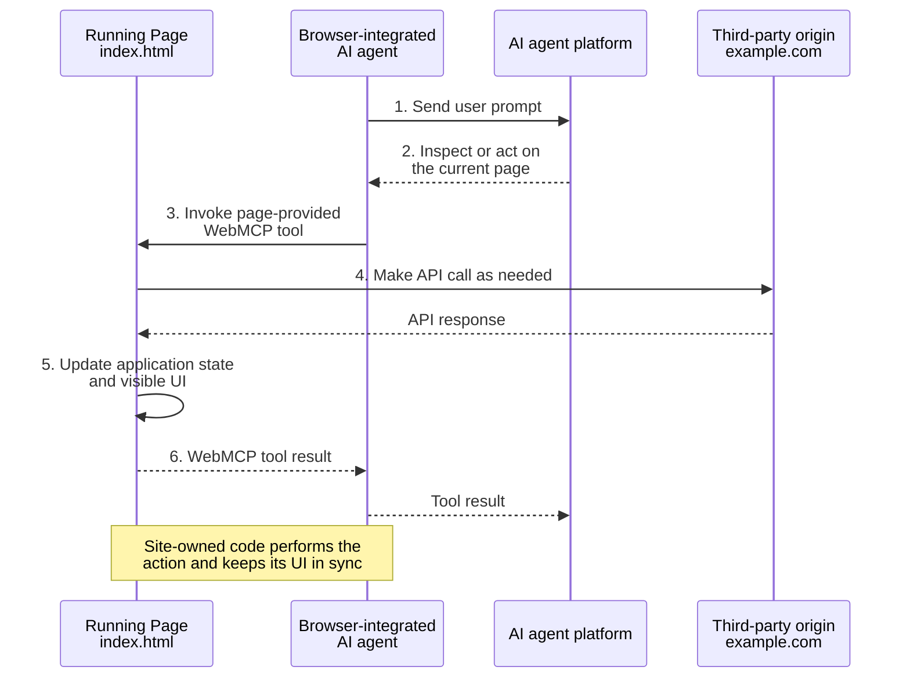
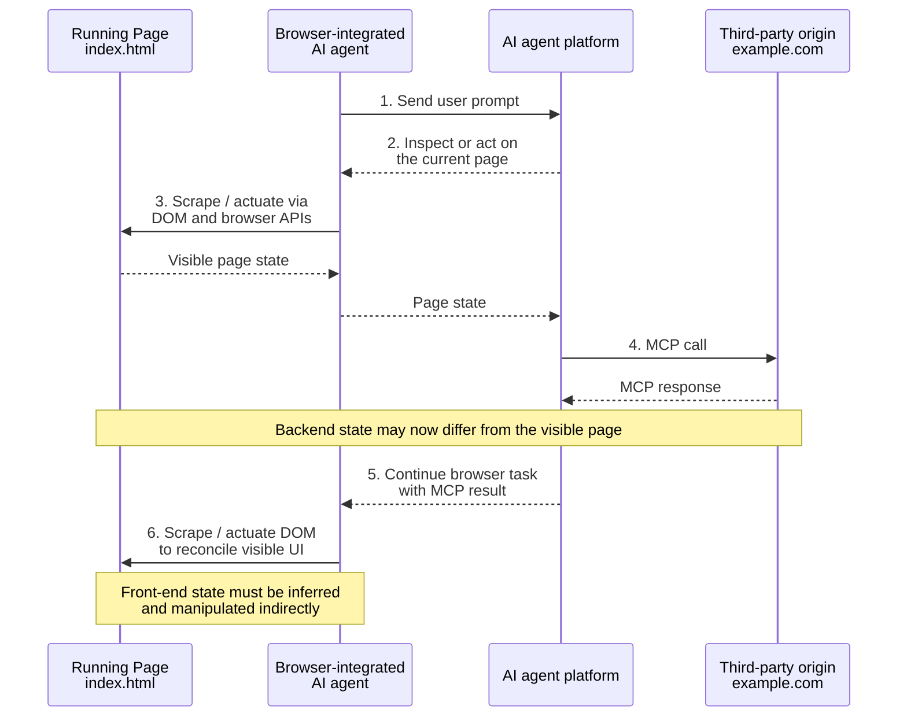

# WebMCP 🧪

WebMCP lets developers expose web application functionality—either JavaScript functions or HTML `<form>` elements—as "tools" with natural language descriptions and structured schemas, designed for AI agent ingestion. These tools can be invoked by AI agents, including those built into the browser, hosted in iframes, or running in extensions to actuate web content that was traditionally designed for human interaction.

TypeScript type definitions for WebMCP are available in the [`webmcp-types`](https://www.npmjs.com/package/webmcp-types) npm package.

See [Implementation Status](implementation-status.md) for browser and agent support, and [Best Practices](#best-practices) for guidance on designing effective tools.

## Background and Motivation

The web platform is the world's largest gateway to information and capabilities. Today, user experiences rely on visual layouts, mouse and touch interactions, and visual cues to communicate functionality and state, but as AI agents become prevalent, the potential for even greater user value is within reach. The motivation of WebMCP is to provide a lightweight way to adapt web content for use by AI agents.


### Backend Integrations vs. In-browser WebMCP Tools

AI platforms such as Copilot, ChatGPT, Claude, and Gemini are increasingly able to interact with external services to perform actions such as checking local weather, finding flight and hotel information, and providing driving directions. This is facilitated by "tools" that external services provide to extend the AI model’s capabilities, and give the AI domain-specific functionality that it cannot obtain on its own.

External tools integrate with each AI platform via bespoke **backend integrations**, such as [Model Context Protocol](https://modelcontextprotocol.io/) or [OpenAPI](https://www.openapis.org/). A service registers its tools with an AI platform, and the platform communicates directly with the service's backend servers via an API. In this document, we call this style of tool a “backend integration”; users make use of the tools by chatting with an AI, and the AI platform communicates with the service on the user's behalf.

Backend integrations work well for server-side actions, but they pose significant challenges for interactive web applications:

- **UI Disintermediation & Context Loss**: Backend integrations take place directly between the agent and the service, bypassing the service's web UI / browser experience.
- **Replication of State & Auth**: Web developers must replicate the user's state, active context, and authentication credentials on a separate server.
- **Developer Burden**: Exposing a site's client-side capabilities requires writing a dedicated backend server, rather than reusing familiar client-side JavaScript.

**WebMCP** introduces a client-side alternative. It allows web developers to define tools directly in the browser page's script. This enables visually rich, cooperative interplay between a user, a web page, and an agent with shared context. Page UI and content remain available to the agent for actuation, but the agent can use WebMCP tools to achieve the user's goals more directly, reliably, and quickly, as the tools are in a format more suited to the agent.

#### WebMCP In-browser tool flow



#### Direct backend MCP flow



Many challenges faced by assistive technology also apply to AI agents that struggle to navigate existing human-first interfaces when agent-first "tools" are not available. Even when agents succeed, simple operations often require multiple steps and can be slow or unreliable.

Web pages that use WebMCP can be thought of as in-page [Model Context Protocol (MCP)](https://modelcontextprotocol.io/introduction) servers that implement tools exposing client-side logic and DOM interaction rather than server-side APIs. WebMCP enables collaborative workflows where users and agents work together within the same web interface, leveraging existing application logic while maintaining shared context and user control.

### Existing web actuation techniques

One of the scenarios we want to enable is making the web more accessible to general-purpose AI-based agents. In the absence of alternatives like MCP servers to accomplish their goals, these general-purpose agents often rely on observing the browser state through a combination of screenshots, and DOM and accessibility tree snapshots, and then interact with the page by simulating human user input. We believe that WebMCP will give these tools an alternative means to interact with the web that give the web developer more control over whether and how an AI-based agent interacts with their site.

The proposed API will not conflict with these existing automation techniques. If an agent or assistive tool finds that the task it is trying to accomplish is not achievable through the WebMCP tools that the page provides, then it can fall back to general-purpose browser automation to try and accomplish its task.


## Goals & Non-Goals

### Goals

- **Enable human-in-the-loop workflows**: Support cooperative scenarios where users delegate tasks to AI agents while maintaining visibility, history, and control over web pages.
- **Simplify AI agent integration**: Enable AI agents to be more reliable and helpful by interacting with web sites through well-defined client-side tools instead of through brittle UI actuation (DOM scraping, simulated clicks).
- **Prevent web content disintermediation**: Prevent disintermediation of web apps by backend integrations by adapting front-ends for use by agents, rather than replacing them.
- **Code reuse**: Any task that a user can accomplish through a page's UI can be turned into a tool by reusing much of the page's existing client-side code.
- **Improve accessibility through agents**: Enable agents to assist users of accessibility technology. WebMCP itself is not designed for ingestion by accessibility technology, nor is it designed to interact directly with a page's accessibility tree; rather, it enables agents to act as highly capable intermediaries (see [Issue #91](https://github.com/webmachinelearning/webmcp/issues/91)).
- **Headless browsing scenarios**: Tools exposed for human-in-the-loop can also be used for task completion in headless scenarios, and is particularly useful when switching between human-in-the-loop and headless experiences.

### Non-Goals

- **Fully autonomous workflows**: The API is not intended for fully autonomous agents where a browser UI is not present, it is meant to be a client-side implementation that can also call server-side APIs. It would not make sense for purely server-side task completion.
- **Replacement of backend integrations**: WebMCP is designed to complement, not replace, existing backend-focused protocols like MCP.
- **Replacement of human interfaces**: The human web interface remains primary; agent tools augment rather than replace user interaction.


## Use Cases

WebMCP enables cooperative workflows where the user collaborates with the agent rather than completely delegating their goal to it.

### Creative & Graphic Design

Jen wants to create a yard sale flyer on `https://easely.example`. She wants to filter templates and make visual edits. Instead of navigating menus, she interacts with her browser's agent:
- **Jen**: "Show me templates that are spring themed and that prominently feature the date and time. They should be on a white background so I don't have to print in color."
- The website has already registered the following tools:
  ```js
  await document.modelContext.registerTool({
    name: "filter-templates",
    description: "Filters the list of templates based on a natural language visual description.",
    inputSchema: {
      type: "object",
      properties: {
        description: { type: "string", description: "A visual description of templates to show." }
      },
      required: ["description"]
    },
    execute({ description }) {
      filterTemplatesInUI(description);
    }
  });
  ```
- The agent invokes `filter-templates` tool, and the UI instantly updates to show matching layouts.
- Once Jen selects a template, the agent notices another tool that was dynamically registered: `edit-design(instructions)`.
- **Jen**: "Please fill in the time and place using my home address. The time should be in my e-mail in a message from my husband."
- **Agent**: "Ok, I've found it—I'll fill in the flyer with: *Aug 5-8, 2025 from 10am-3pm | 123 Queen Street West*. Would you like me to make the date font larger and swap out the clipart for yard-sale illustrations?"
- **Jen**: "Yes, please. Also, let's use 'Yard Sale Extravaganza!' as the title, and create duplicate pages comparing different calls to action."
- The agent automates this by executing a sequence of tool calls to `edit-design`. The graphic design page applies these edits as a batch of "uncommitted" changes in the UI, allowing Jen to review or adjust them.
- **Agent**: "Done! I've created three variations of your design, each with a unique call to action."
- **Jen is ready to finalize the flyers**. Normally, she would export a PDF and find a local print shop. However, the page has also registered an `order-prints` tool:
  ```js
  await document.modelContext.registerTool({
    name: "order-prints",
    description: "Orders the current design for printing and shipping to the user.",
    inputSchema: {
      type: "object",
      properties: {
        copies: { type: "number", description: "Number of copies between 1 and 1000." },
        pageSize: { type: "string", enum: ["Letter", "Legal", "A4"], default: "Letter" }
      },
      required: ["copies"]
    },
    execute({ copies, pageSize }) {
      initiatePrintCheckout(copies, pageSize);
    }
  });
  ```
- Spotting this tool, the agent offers to help and surfaces an inline print option. Jen specifies she wants 10 copies, and the agent executes the tool, automatically navigating the browser tab to the secure checkout page where Jen can complete the order with a single click.

### E-Commerce & Tailored Shopping

Maya is shopping for dresses on `http://wildebloom.example/shop`.
- **Maya**: "Show me only dresses available in my size, and also show only the ones that would be appropriate for a cocktail-attire wedding."
- The page has already registered tools to search and display products:
  ```js
  await document.modelContext.registerTool({
    name: "get-dresses",
    description: "Returns an array of product listings containing id, description, price, and photo.",
    inputSchema: {
      type: "object",
      properties: {
        size: { type: "number", description: "Optional EU dress size to filter by." },
        color: { type: "string", description: "Optional color to filter by." }
      }
    },
    async execute({ size, color }) {
      const response = await fetchDresses(size, color);
      return response.json();
    }
  });
  await document.modelContext.registerTool({
    name: "show-dresses",
    ...
  });
  await document.modelContext.registerTool({
    name: "filter-products",
    ...
  });
  ```
- The agent calls `get-dresses(6)` (automatically translating Maya's size into EU units from her browser profile context) and receives a JSON array of detailed product listings:
  ```json
  {
    "products": [
      {
        "id": 1021,
        "description": "A short sleeve midi dress in organic cotton with a floral print...",
        "price": "€180",
        "image": "img_1021.png"
      },
      {
        "id": 4320,
        "description": "A straight-cut formal linen gown on plant-based dyes...",
        "price": "€220",
        "image": "img_4320.png"
      },
      {
        "id": 684,
        "description": ...
      },
      ...
    ]
  }
  ```
- The agent processes this list, fetching each image and using the user's criteria to filter the dresses. It then calls the tool `show-dresses([1021, 4320, 684, ...])`. This updates the UI on the page to show only the requested dresses.
- **Maya** uploads a photo of a favorite summer dress she owns: "Are there any dresses similar to the color and style of the one in this photo?"
- **Agent**: "I've analyzed your photo's color tone and A-line cut. Let me filter the store grid to show options matching that style."
- The agent uses its vision capabilities to match the product images against Maya's photo, compiles the list of matching IDs, and runs the tool `filter-products([1021, 684])`, instantly updating the site's UI with relevant dresses.

### Specialized Developer Workflows

John is a software developer performing a code review in [Gerrit](https://www.gerritcodereview.com/). The interface is complex, but the page registers helpful tools to inspect trybot statuses and retrieve logs, perfect for agents that are typically trained on everyday usage, and may otherwise do a poor job actuating such complicated interfaces.

- **John**: "Why are the Mac and Android trybots failing?"
- The page has already registered the following tools:
  ```js
  await document.modelContext.registerTool({
    name: "get-trybot-statuses",
    description: "Returns the current status of all trybot runs for the active patch.",
    execute() {
      return activePatch.getStatuses();
    }
  });

  await document.modelContext.registerTool({
    name: "get-trybot-failure-snippet",
    description: "If a bot failed, returns the tail log snippet describing the error.",
    inputSchema: {
      type: "object",
      properties: {
        botName: { type: "string", description: "The bot name to query." }
      },
      required: ["botName"]
    },
    execute({ botName }) {
      return activePatch.getFailureSnippet(botName);
    }
  });
  ```
- The agent invokes `get-trybot-statuses` and receives a JSON array representing the trybot statuses:
  ```json
  [
    { "botName": "mac-x64-rel", "status": "FAIL" },
    { "botName": "android-15-rel", "status": "FAIL" }
  ]
  ```
- The agent then automatically calls `get-trybot-failure-snippet` for each failing bot. After ingesting the logs, it reports back:
  - **Agent**: "The Mac bot is failing with an 'Out of Space' infrastructure error. The Android bot is failing while linking with a missing symbol `gfx::DisplayCompositor`."
  - **John**: "Ah! BUILD.gn is missing `display_compositor_android.cc`. Please add a suggested edit to the build file adding it to the Android sources."
- The agent uses a registered `add-suggested-edit(filename, patch)` tool to apply the diff. The Gerrit UI instantly displays the suggested patch as a code-review diff for John to accept, modify, or reject.


## Detailed Design

WebMCP introduces an imperative API on the web platform under `document.modelContext`. This interface allows pages to expose client-side actions that agents can discover and invoke in a secure, browser-mediated environment.

### Imperative Tool Registration: `document.modelContext`

A Model Context Provider registers tools by calling the `document.modelContext.registerTool()` method. 

```js
const controller = new AbortController();

await document.modelContext.registerTool({
  name: "add-todo",
  description: "Add a new item to the user's active todo list",
  inputSchema: {
    type: "object",
    properties: {
      text: { type: "string", description: "The text content of the todo item" }
    },
    required: ["text"]
  },
  async execute({ text }) {
    // Reuse existing client-side application logic and update UI.
    await addTodoItemToCollection(text);
    
    return {
      content: [
        {
          type: "text",
          text: `Added todo item: "${text}" successfully.`
        }
      ]
    };
  }
}, { signal: controller.signal });

// To unregister the tool later, abort the signal.
// controller.abort();
```

Tools can be unregistered at any time by aborting the signal. For applications with many potential tools, dynamically registering and unregistering them based on the active page state is a recommended pattern to avoid overloading the agent's context window (see [Best Practices](#best-practices)).

### Lifecycle of a Tool Call
1. **Registration**: The web page registers one or more tools using `document.modelContext.registerTool()`.
2. **Discovery**: An agent connected to the page queries the browser to discover the active list of tools and their schemas.
3. **Invocation**: The agent requests a tool call, sending structured arguments matching the tool's `inputSchema`.
4. **Execution**: The browser mediates the call, invokes the tool's `execute` callback with the provided arguments, and executes client-side logic on the page.
5. **Response**: The page's callback returns structured results back to the agent, which processes them to continue collaborating with the user.

### Declarative API

For forms and standard HTML inputs, a declarative counterpart to the imperative API allows the browser to automatically synthesize tool definitions from `<form>` elements. This is detailed in the [Declarative API Explainer](./declarative-api-explainer.md). It will be soon folded into this explainer document.

We've gotten the following question a few times:

> why isn't declarative WebMCP sufficient on its own—why must there be an imperative counterpart? 

The reason WebMCP is not limited to only declarative form tools is for the same reason that websites cannot be built exclusively out of declarative forms. Some of the web's functionality is only possible with JavaScript, and for WebMCP to represent the web's full functionality to agents, it must be able to expose that JavaScript functionality through imperative tools, not just declarative ones.

### Permissions policy and iframes

While much of this explainer assumes integration with built-in browser agents, WebMCP also supports **author-provided agents**, such as agents embedded directly on a page or running in an iframe, that can collaborate with parent frames and nested contexts.

By default, WebMCP is enabled in top-level `Window`s and its same-origin iframes, but access can be delegated to cross-origin iframes using the [Permissions Policy](https://developer.mozilla.org/en-US/docs/Web/HTTP/Guides/Permissions_Policy) `allow="tools"`:

  ```html
  <iframe src="https://chat-bot-provider.example/" allow="tools"></iframe>
  ```

Calls to `document.modelContext.registerTool()` will return a promise rejected with `NotAllowedError` DOMException when the permission is disabled, whether by the `allow` attribute or the `Permissions-Policy: tools=()` header. Handling of declarative tool registration errors, including when the permission is disabled is TBD; see [Issue #182](https://github.com/webmachinelearning/webmcp/issues/182).

#### Cross-origin iframe exposure: `registerTool() and `exposedTo`

By default, tools registered by a document are only exposed to itself, same-origin documents in the same tree, and built-in browser agents (see this <a href=#built-in-agent-default-exposure>discussion</a>). To support author-provided agents running in frames, developers can selectively share tools with specific secure origins via the `exposedTo` option:

```js
await document.modelContext.registerTool({
  name: "share-location",
  description: "Returns the user's office location.",
  execute() { return { office: "Building 4" }; }
}, { exposedTo: ["https://trusted-partner.example"] });
```

Any document in the tree matching these origins (and allowed to use `tools` permission) will:

- Receive the `toolchange` event on its `document.modelContext` when the tool is registered or unregistered.
- Be able to discover and run the tools

#### Discovering and running tools: `getTools()` and `executeTool()`

Once tools are registered, in-page agents can discover and invoke them using `getTools()` and `executeTool()`.

Calling `document.modelContext.getTools()` returns a promise that resolves with an array of `RegisteredTool` dictionary objects. Each object contains the tool's `name`, `description`, `inputSchema`, `outputSchema`, `origin`, and owner `window`. By default, `getTools()` only returns tools registered by documents same-origin with the caller in the frame tree. To retrieve cross-origin tools, you must explicitly list their origins in the `fromOrigins` option. This array only supports secure origins.

```js
// Discover tools exposed by same-origin frames in the tree (default)
const tools = await document.modelContext.getTools();

for (const tool of tools) {
  console.log(`Tool: ${tool.name} (from ${tool.origin})`);
  console.log(`Description: ${tool.description}`);
  console.log(`Parameters schema:`, tool.inputSchema);
  console.log(`Output schema:`, tool.outputSchema);
}

// Discover additional tools provided by a cross-origin frame (in addition to
// same-origin ones):
const crossOriginTools = await document.modelContext.getTools({
  fromOrigins: ["https://trusted-partner.example"]
});
```

An agent executes a discovered `RegisteredTool` by passing the tool dictionary and input arguments along to `document.modelContext.executeTool()`. The browser securely mediates the execution, ensuring the [`exposedTo`](https://webmachinelearning.github.io/webmcp/#dom-modelcontextregistertooloptions-exposedto) and [`fromOrigins`](https://webmachinelearning.github.io/webmcp/#dom-modelcontextgettooloptions-fromorigins) agree, and the tool runs in the tool owner's execution context:

```js
const tools = await document.modelContext.getTools();
const addTodoTool = tools.find(t => t.name === "add-todo");

if (addTodoTool) {
  try {
    const result = await document.modelContext.executeTool(
      addTodoTool,
      { text: "Buy groceries" }
    );
    console.log("Tool result:", result);
  } catch (error) {
    console.error("Tool execution failed:", error);
  }
}
```

##### Cancelling execution with `AbortSignal`

Tool invocations can be cancelled mid-execution (e.g., if the user aborts an ongoing request, as they might with the "stop button" that's present in most agent UIs) by passing an `AbortSignal`:

```js
const controller = new AbortController();

const executionPromise = document.modelContext.executeTool(
  addTodoTool,
  { text: "Buy groceries" },
  { signal: controller.signal }
);

// If the user cancels the interaction:
stopButton.addEventListener('click', e => controller.abort());
```

The tool's [execution callback](https://webmachinelearning.github.io/webmcp/#callbackdef-toolexecutecallback) receives a corresponding signal via its [`options.signal`](https://webmachinelearning.github.io/webmcp/#dom-toolexecutecallbackoptions-signal) parameter, allowing it to abort underlying network requests or asynchronous tasks cleanly.

##### Responding to dynamic tool updates: the `toolchange` event

When tools are added, removed, or updated dynamically (such as when user interactions result in new tools being registered), `document.modelContext` fires a `toolchange` event:

```js
document.modelContext.addEventListener("toolchange", async () => {
  const currentTools = await document.modelContext.getTools();
  updateAgentToolRegistry(currentTools);
});
```


## Best Practices

Designing tools for AI agents requires different considerations than building traditional user interfaces or server-side APIs. For comprehensive guidance, see the [Chrome WebMCP Best Practices guide](https://developer.chrome.com/docs/ai/webmcp/best-practices) and [Creating Security-Minded Tools](https://developer.chrome.com/docs/ai/webmcp/secure-tools). Key recommendations include:

### Tool Strategy and Budget

- **Mind the tool budget and context window**: While the WebMCP specification does not define an arbitrary architectural limit on how many tools a page can register, AI models have finite context windows. Every registered tool (its name, description, and input schema) consumes tokens in the model prompt, adds to inference latency, and increases the potential for tool confusion or hallucination. Exposing too many tools (e.g., dozens or hundreds) can severely degrade agent performance or lead agent browsers to drop tools or fail to process them.
- **Single responsibility**: Each tool should represent a single, well-defined function. Avoid registering overlapping or redundant tools that perform similar actions, as this confuses the agent during tool selection.
- **Manage tool registration dynamically**: Rather than registering a large catalog of tools upfront, dynamically register tools relevant to the active page state or workflow, and unregister them when no longer applicable by aborting the `AbortSignal` passed to `registerTool()` (or removing form attributes in the declarative API).
- **Default to static registration for simple apps**: For simpler web applications with a handful of tools, static registration on page load is recommended. Dynamic lifecycle management is most valuable for complex, multi-state applications.
- **Trust the agent**: Frame tool descriptions around what the tool accomplishes and what inputs it requires, rather than trying to enforce rigid step-by-step procedural chains through prompt text.

### Clear Language and Semantic Naming

- **Precise verbs and distinctions**: Distinguish immediate execution from initiating a workflow (e.g., `create-event` to immediately book an event vs. `start-event-creation` to navigate to an event form).
- **Positive, descriptive instructions**: Tool descriptions should clearly state what the tool does and when to use it. Prefer positive framing ("This tool searches products by keyword...") over negative constraints ("Do not use this for orders").

### Minimize Cognitive Computing for the Model

- **Accept raw user input**: Do not require the model to perform mental math, convert time zones, or transform complex strings. Accept raw input where reasonable and handle normalization in your client code.
- **Use self-explanatory enum values and types**: Prefer natural language strings in enums (e.g., `shippingMethod: "express"`) rather than arbitrary internal IDs (e.g., `shippingId: 1`).
- **Document schemas with descriptions**: Provide helpful `description` fields on all input parameters in `inputSchema` to help the agent supply appropriate values.

### Reliability and Error Handling

- **Validate strictly in code, loosely in schema**: Schema constraints provide hints to models, but strict schema validation failures can cause agents to stall. Perform detailed validation in your `execute` handler and return clear, actionable error messages so the agent can self-correct and retry with valid arguments.
- **Handle rate limits and failures gracefully**: If an action is rate-limited or fails, return an informative error message or instruct the agent to ask the user to complete the task manually in the UI.
- **Synchronize visual UI state**: Ensure the web page's visual UI updates immediately to reflect actions taken by tools. AI agents and human users collaborate in the same browser session, so shared, synchronized state is essential.


## Alternatives Considered

### 1. Direct Adoption of the Backend MCP Specification

We considered directly adopting the full Model Context Protocol (MCP) spec in the browser without creating a web-native API. However:
- MCP was built primarily for server-to-client and stdio/SSE process communication. It lacks native web concepts like origins, standard browser permissions, DOM integration, and tab-level lifecycle management.
- Coupling a web API directly to an actively evolving backend protocol would hinder backward compatibility and platform stability.

Instead, WebMCP derives direct inspiration and shares a **common vocabulary** with MCP (e.g., tools, schemas, parameters), but provides a form-fitting, client-safe solution designed natively for the web platform.

### 2. Static Declarative Manifests

We considered declaring tools solely inside static manifest files (like the Web App Manifest). While useful for offline or background discovery:
- Static manifests prevent web developers from dynamically adding, updating, or removing tools based on the active page state or user authentication status.
- Manifests cannot contain executable code, meaning developers would still need an imperative way to register execution handlers.

Our current approach allows imperative script-based registration, with the potential for static declarations to be layered on in the future.

### 3. Event-Based Tool Execution (`'toolcall'`)

Another alternative was to handle tool execution exclusively via window-level events:

```js
document.agent.addEventListener('toolcall', async (e) => {
  if (e.name === 'add-todo') {
    e.respondWith(handleAddTodo(e.arguments));
  }
});
```
- *Disadvantages*: This approach separates a tool's schema declaration from its implementation, making it harder to keep definitions and code in sync. It also leads to large `switch-case` statement blocks in event handlers.
- *Hybrid Approach*: We may still consider a hybrid model where a `"toolcall"` event is dispatched on the window *before* falling back to executing the registered imperative `execute` callback, allowing advanced interception.


## Prior Art

- **Model Context Protocol (MCP)**: Developed by Anthropic, MCP is supported by Claude Desktop and enables applications to connect with AI models.
- **WebMCP (MCP-B)**: An open-source project (see [MCP-B](https://mcp-b.ai/)) implementing browser tab and extension transports for local in-page communication.
- **OpenAPI**: The standard specification for describing HTTP APIs, used in platform-specific extensions like ChatGPT Actions.
- **Agent2Agent (A2A) Protocol**: A protocol focused on connecting distinct autonomous AI agents to one another.


## Security and Privacy Considerations

Interacting with AI agents crosses traditional trust boundaries. Security, privacy, permissions policy, and origin isolation are crucial aspects of this proposal.

For our current considerations, refer to the [Security and Privacy Considerations](https://webmachinelearning.github.io/webmcp/#security-privacy) section of the specification.


## Open Questions

As the WebMCP proposal continues to evolve with community and stakeholder feedback, we are tracking several active design discussions and technical challenges:

- **Multimodal input/output**: AI agents are increasingly multimodal, and we should consider how tools can consume binary media as inputs and how to return them as outputs (e.g., audio, streams, media blobs, etc.). See [Issue #41](https://github.com/webmachinelearning/webmcp/issues/41), [Issue #86](https://github.com/webmachinelearning/webmcp/issues/86), and [Issue #81](https://github.com/webmachinelearning/webmcp/issues/81), and [Prompt API: Multimodal inputs](https://github.com/webmachinelearning/prompt-api#multimodal-inputs).

- **Cross-document tool response**: How should WebMCP handle tool responses when a tool (a form submission, for example) causes the page to navigate to another document? See [Issue #135](https://github.com/webmachinelearning/webmcp/issues/135).

- **Built-in agent exposure by default**: <p id=built-in-agent-default-exposure>The [`exposedTo`](https://webmachinelearning.github.io/webmcp/#dom-modelcontextregistertooloptions-exposedto) array only takes origins, but we're considering introducing a new keyword like `native-agent`, letting authors control a tool's exposure to a built-in agent. The running idea is that by default in the top-level document, a missing `exposedTo` array would expose tools to the built-in agent, and in iframes, a missing `exposedTo` array would not expose tools to the built-in agent</p>

- **Transferable/streamable tool inputs and outputs**: AI models inherently support streaming data. WebMCP should consider enabling streaming tool inputs and outputs (such as chunked generation or large data transfers) without blocking on a massive copy. See [Issue #82](https://github.com/webmachinelearning/webmcp/issues/82). See also [MCP discussion](https://github.com/modelcontextprotocol/modelcontextprotocol/discussions/263) and [MCP Apps streaming tool inputs](https://github.com/modelcontextprotocol/ext-apps/blob/main/specification/draft/apps.mdx#notifications-host--view).

- **Input and output schema validation**: Investigating native validation of tool inputs and outputs against declared JSON schemas before invoking the page's JS execution callback, or letting the output reach the model. See [Issue #92](https://github.com/webmachinelearning/webmcp/issues/92).

- **Skills Integration**: Determining if the author should expose a higher-level "skill" to help the agent coordinate multiple related tools to fulfill a user journey. See [Issue #161](https://github.com/webmachinelearning/webmcp/issues/161).

- **User prompting and elicitation**: Exploring a way for a tool to prompt the user for confirmation when tools require explicit user authorization. This could be done by delegating to the agent and its harness, or by invoking native browser permission dialogue outside of the agent loop. See [Issue #165](https://github.com/webmachinelearning/webmcp/issues/165) and [Issue #50](https://github.com/webmachinelearning/webmcp/issues/50) for discussion about the `ModelContextClient` interface.

- **Tool progress reporting**: For long-running tasks (e.g., batch processing or generating content), the agent may want a way to track a tool's progress. We are exploring how this intersects with the established [MCP Progress](https://modelcontextprotocol.io/specification/2025-11-25/basic/utilities/progress) specification.

- **Service workers integration**: Extending WebMCP to background Service Workers to allow agents to discover and invoke tools on sites the user doesn't currently have open. This is detailed in the supplementary [Service Workers Explainer](./docs/service-workers.md), which proposes background discovery mechanisms, session identification, and JIT worker installation.


## Acknowledgments

> First published August 13, 2025
>
> Brandon Walderman <code>&lt;brwalder@microsoft.com&gt;</code><br>
> Leo Lee <code>&lt;leo.lee@microsoft.com&gt;</code><br>
> Andrew Nolan <code>&lt;annolan@microsoft.com&gt;</code><br>
> David Bokan <code>&lt;bokan@google.com&gt;</code><br>
> Khushal Sagar <code>&lt;khushalsagar@google.com&gt;</code><br>
> Hannah Van Opstal <code>&lt;hvanopstal@google.com&gt;</code>

Since then, the specification draft has evolved significantly, primarily driven by [Dominic Farolino](https://github.com/domfarolino).

Many thanks to [Alex Nahas](https://github.com/MiguelsPizza) and [Jason McGhee](https://github.com/jasonjmcghee/) for sharing their valuable [implementation](https://github.com/MiguelsPizza/WebMCP) [experience](https://github.com/jasonjmcghee/WebMCP).
